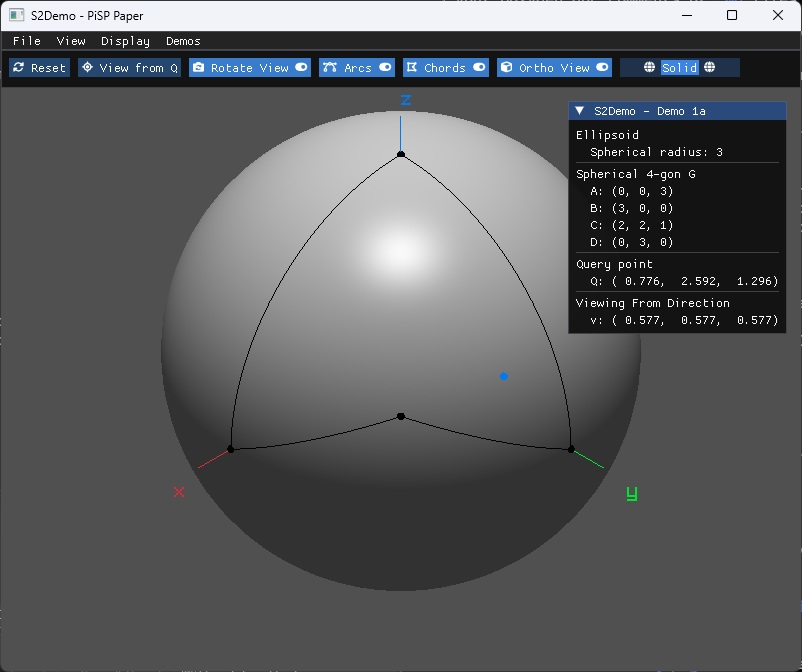
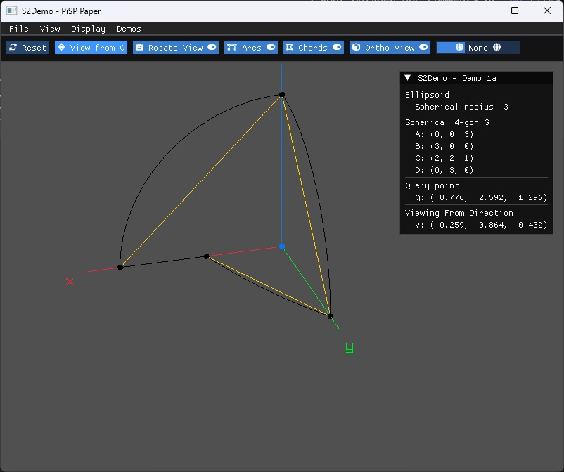
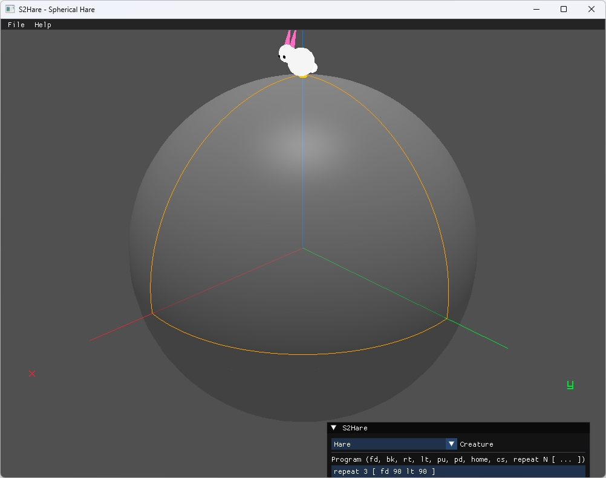

# S²LikeLib

*Under active development.*
A lightweight, efficient, and robust suite of C++20 tools and library for spheres and sphere-like surfaces.


## Build & Installation

### Standard Build

```bash
git clone https://github.com/S2LikeMinded/S2LikeLib.git
cd S2LikeLib
cmake -B build
cmake --build build
```

### Using CMake Presets

```bash
# Configure and build Debug configuration
cmake --preset debug
cmake --build --preset debug

# Configure and build Release configuration
cmake --preset release
cmake --build --preset release

# Build documentation
cmake -B build -DBUILD_DOCS=ON && cmake --build build --target doc
```

### Installation

To install `S2LL` library, headers, and apps (`S2Edit`, etc.):

```bash
# Local directory (No Admin rights needed):
cmake --install build --prefix ./install

# System-wide to Program Files or /usr/local (Requires Admin / sudo):
cmake --install build
```


## Modules

 - Shapefile parser, containing:
   - [`shp`](https://en.wikipedia.org/wiki/Shapefile#Shapefile_shape_format_(.shp)) by `S2LL::Parser::SHPReader` for Polygon (shape type 5) only
   - [`prj`](https://docs.ogc.org/is/18-010r11/18-010r11.pdf) by `S2LL::Parser::PRJReader` as a [tree](https://en.wikipedia.org/wiki/Tree_(abstract_data_type))


# Apps

Applications are implemented in individual folders under `./app` and compiled into `./bin`.

## S²Demo

An interactive tool to demonstrate the results of some peer-reviewed articles.

| Spherical 4-gon (Demo 1a)                       | View from Query Point Q                           |
| :---------------------------------------------: | :-----------------------------------------------: |
|  |  |

- In the S²Demo shell, run demo 1 through `run 1` and list all demos using `list`.
- In the terminal, run demo 1 through `S2Demo 1`.

## S²Edit

An interactive CLI tool for inspecting, processing, and editing ellipsoidal
and spherical geographic regions.

## S²Hare



An interactive toy for running Logo-style turtles on a sphere: a hare (or a
tortoise, switchable in the settings) crawls along great circles, leaving a
trail behind it. Write a program using `fd` / `bk` / `rt` / `lt` / `pu` /
`pd` / `home` / `cs` / `repeat`, run presets, and drag to orbit the sphere.

S²Hare is not the first ~~turtle~~ creature on the sphere, but it sure is fun to implement
as an experimental app and a demonstration for the greater library.
Related efforts or prior work, as a non-exhaustive list:

- Abelson, H., & DiSessa, A. (1986).
  [*Turtle geometry: The computer as a medium for exploring mathematics.*](https://search.worldcat.org/title/6914987)
  MIT Press.
- Redick, M. B. (2012).
  *Math on a Sphere: Implementing a Programming Language for Learners*
  (Master's thesis, University of Colorado at Boulder).
- Swart, D. (2009, July).
  [Using Turtles and Skeletons to Display the Viewable Sphere.](https://archive.bridgesmathart.org/2009/bridges2009-39.pdf)
  In *Proceedings of Bridges 2009: Mathematics, Music, Art, Architecture, Culture* (pp. 39-46).
- GéoTortue – Nouvelle Génération.
  [Website](http://geotortue.free.fr)

S²Hare follows most traditions, but with differences that reflect this project's
goals: its computational foundations in `S2LL::Numerics` and non-browser nativeness.

# Dependencies

## Core & CLI

 - `p-ranav/argparse` [[GitHub]](https://github.com/p-ranav/argparse) [[vcpkg]](https://vcpkg.io/en/package/argparse) — command-line argument parsing
 - `daniele77/cli` [[GitHub]](https://github.com/daniele77/cli) [[vcpkg]](https://vcpkg.io/en/package/cli) — interactive CLI shell
 - `catchorg/Catch2` [[GitHub]](https://github.com/catchorg/Catch2) [[vcpkg]](https://vcpkg.io/en/package/catch2) — unit testing framework

## S²Demo

 - `raysan5/raylib` [[GitHub]](https://github.com/raysan5/raylib) [[vcpkg]](https://vcpkg.io/en/package/raylib) — 3D rendering
 - `ocornut/imgui` [[GitHub]](https://github.com/ocornut/imgui) [[vcpkg]](https://vcpkg.io/en/package/imgui) — immediate-mode GUI
 - `raylib-extras/rlImGui` [[GitHub]](https://github.com/raylib-extras/rlImGui) — Raylib + Dear ImGui integration
